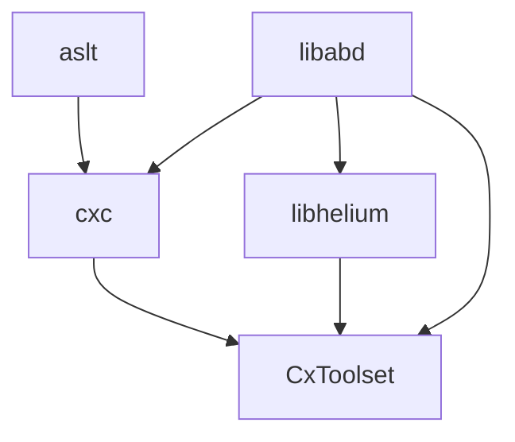

# A Calculator using CX and AWTK #

[Calc Running as Example](https://iamkky.github.io/cxtest/test)

## Building Order ##

```mermaid
graph TD;
	aslt-->cxc
	libabd-->cxc
	libabd-->libhelium;
	cxc-->CxToolset;
	libhelium-->CxToolset;
	libabd-->CxToolset;
```
	
